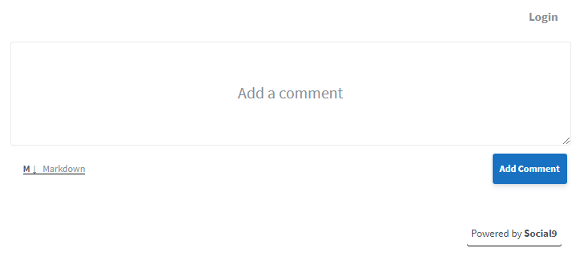

Welcome to the Social9 Comment! If you're here for the first time, read this page to get started; it'll answer most of the frequently asked questions.

## Precondition

> Note: The plugin cannot be used if the prerequisites are not met, and the problems of installing this plugin when the prerequisites are not met will not be dealt with, and how to achieve the following prerequisites will not be dealt with!

1. Node.js >= 12.0
2. Use [Git](https://git-scm.com/) to manage the blog **source code**.
3. Use the `git log -1 --date=iso --pretty=format:"%ad"` command in the blog root directory to output a date.
4. How to determine whether the first item meets:
5. The blog root directory contains the `.git` folder, which is a hidden folder.
6. Meets the third item above.

## Installation

```shell
npm i hexo-social9-comment -S
```

or

```shell
cnpm i hexo-social9-comment -S
```

## Usage
Use as a helper function in **footer.ejs** theme templates `</body>`

```ejs
<%- s9CommentScript({}) %>
```

### Use in template file

```
<%- s9CommentBox({}) %>
```

### Use as a tag in md files for Comment Box

> Note: Please use strict JSON format for this method!

```nunjucks


```


## Description -

Welcome to the Social9 Comment! If you're here for the first time, read this page to get started; it'll answer most of the frequently asked questions.

## What is Social9 Comment?

Comment help you to grow discussions on your website – if you have a blog, you can embed Social9 Comment if you want your readers to add comment. It's fast and free, has a modern interface, and is reasonably secure. Unlike most alternatives, Social9 Comment is lightweight and privacy-focused; I'll never sell your data, show ads, embed third-party tracking scripts, or inject affiliate links.

## Frequently Asked Questions

### I don't want to install and manage Social9 Comment on a server.

Social9 comment is a cloud-based solution where we take care of the server hosting, updates, and security and performance tuning for you. It is absolutely free.

### What features does Social9 Comment have?

Social9 Comment comes with a lot of useful features out-of-the-box: rich text support, upvotes and downvotes, automatic spam detection, moderation tools, sticky comment, thread locking, OAuth login, email notifications, and more!

### What does Social9 Comment look like? Do you have a demo?

Check out the screenshot below.


### How is Comment different from Disqus, Facebook Comment, and the rest?

Most other products in this space do not respect your privacy; showing adverts is their primary business model and that nearly always comes at the users' cost. We are providing everything for free and do not compromise with privacy.

### Is Comment free software?

Yes. Comment is made freely available and it will always stay that way.

### Disqus has a free plan. Why is the cloud version not free of cost?

When I say Comment is free, I mean free. The cloud version is offered free of cost because we are more focused on delivering value. We are aiming a whole social media solution that why we are not charging anything from our customers.

### Okay, how do I get started?

Glad you asked! please follow the steps written below.